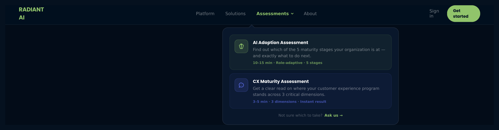
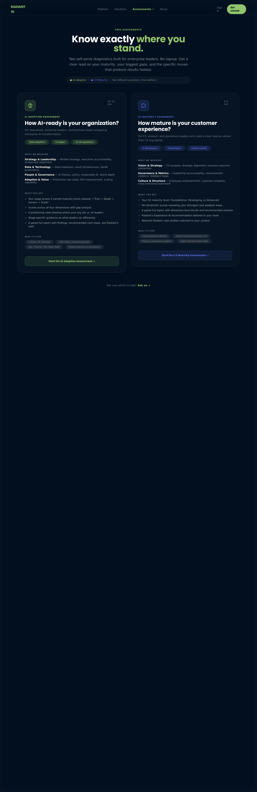
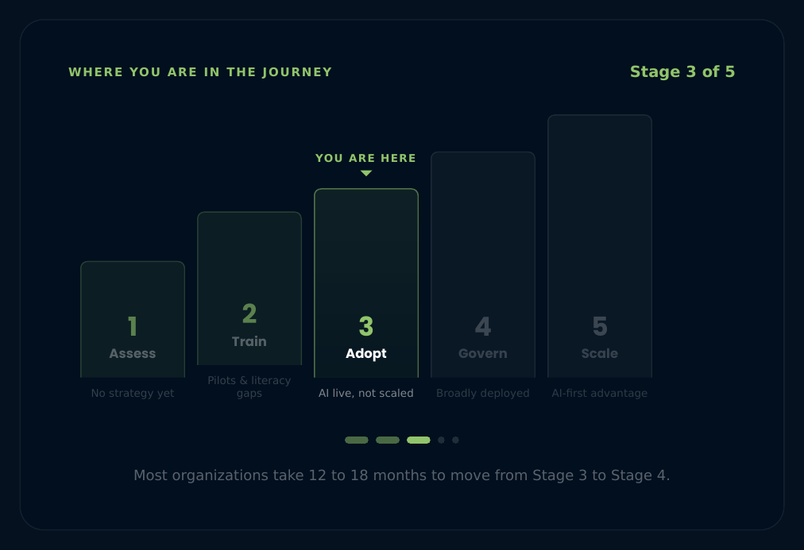
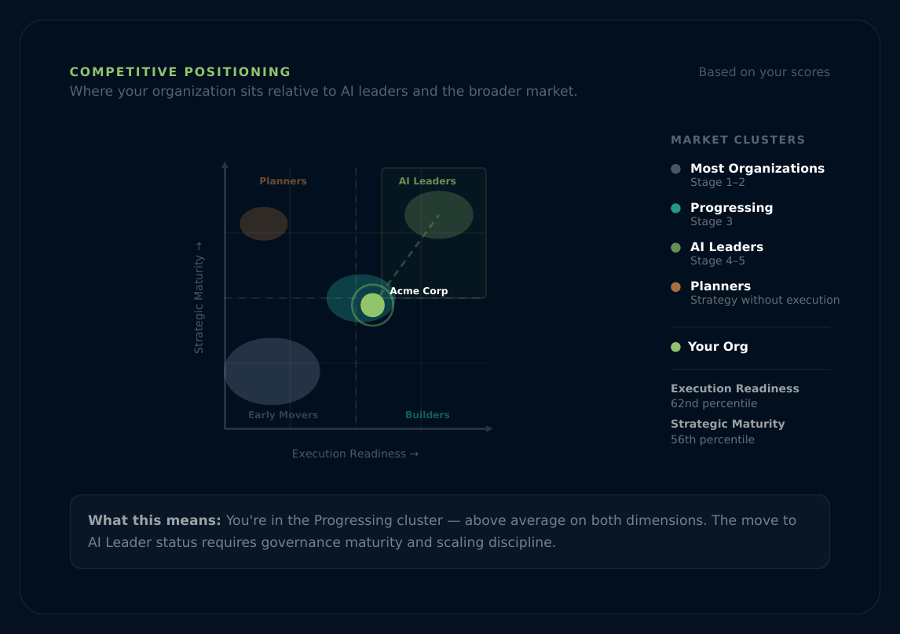
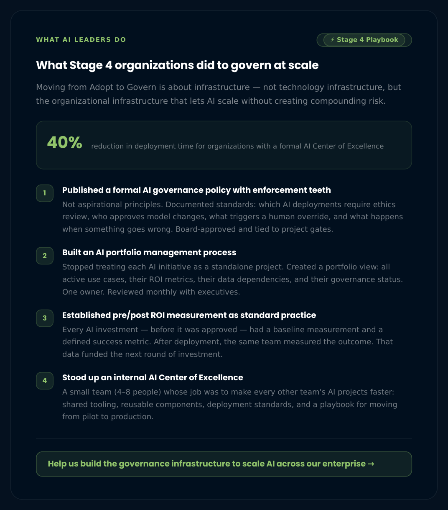
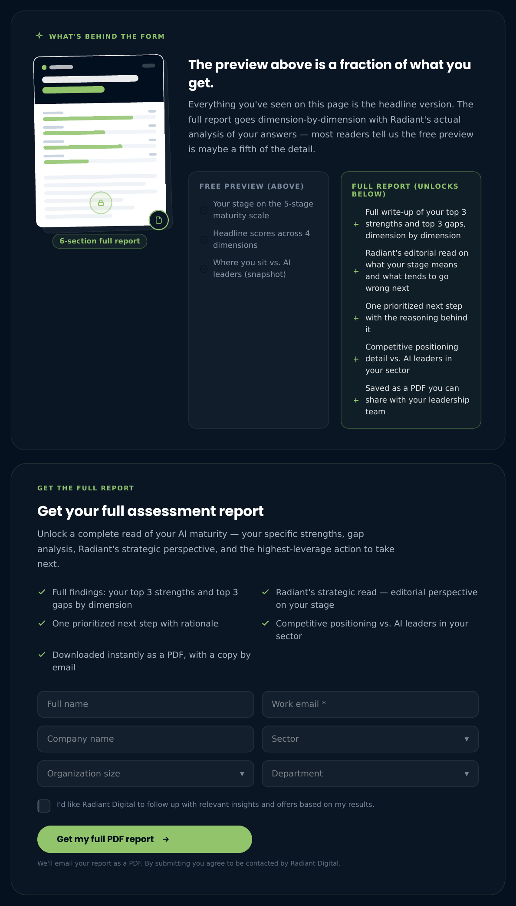
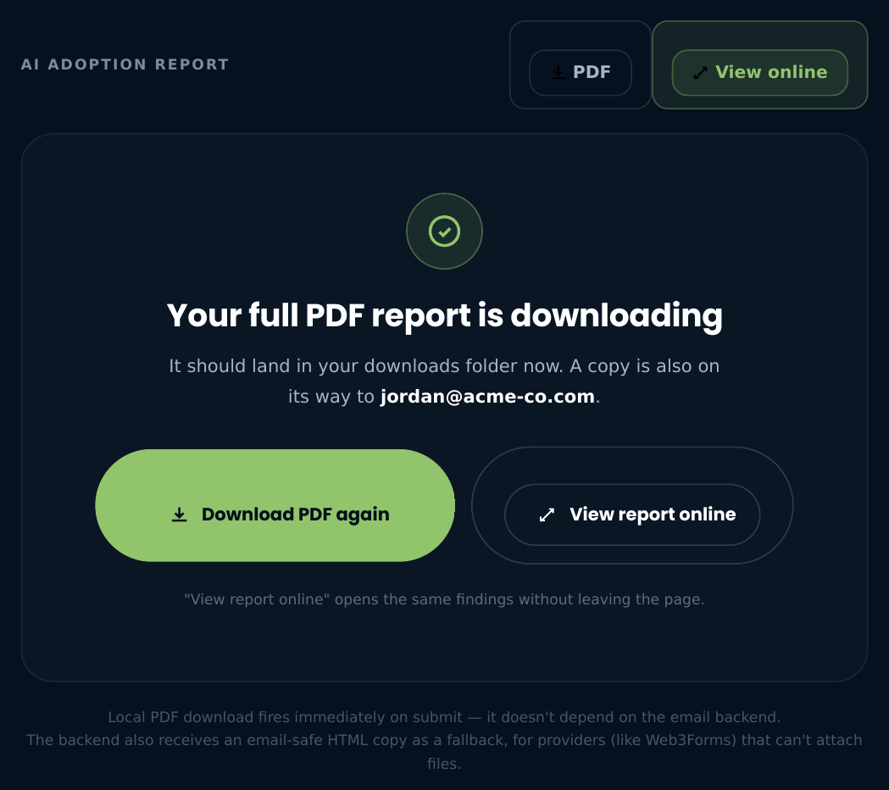

# Radiant Digital — Assessment Platform
## Product Specification v2.1

**Status:** Production Source of Truth  
**Replaces:** radiant-ai-assessment-spec-v2.md (v2.0)  
**Last Updated:** 2026-06-16  
**Scope:** AI Adoption Assessment + CX Maturity Assessment + Assessment Hub + Chat Integration

**What's new in v2.1:** Nav renamed "Assessment" → "Assessments" dropdown with per-assessment previews; Assessment Hub redesigned (What we measure / What you get / Who it's for); two new results visualizations (MaturityStaircase, GartnerPositioningView) plus a stage-specific guidance card (WhatAILeadersDo); report delivery moved to PDF-primary with a dual payload (PDF + email-safe HTML); a pre-gate ReportPreviewTeaser makes the value gap visible before the form; HTMLReportViewer demoted to a secondary "view online" option. Full change list in the Changelog section below.

---

## Changelog

### v2.1 — 2026-06-16

**1. Navbar: "Assessment" link → "Assessments" dropdown**
The single nav link is now a dropdown. Hovering/clicking "Assessments" reveals both assessments as separate cards with a one-line description and time estimate, so visitors pick the right one before clicking through. Mobile menu mirrors this with an accordion. See Section 3.2.



**2. Assessment Hub redesign**
Each assessment card now answers three questions instead of one: what we measure (dimensions with icons), what you get (the actual report contents, spelled out), and who it's for (role pills). Previously the cards were a title + description + CTA — visitors had to click in to find out what they'd actually receive. Now that's visible on the hub itself. See Section 4.



**3. MaturityStaircase — new results visualization**
A 5-column ascending staircase showing where the respondent's stage sits relative to the other four. Past stages are faint, the current stage is highlighted with a "You are here" marker, future stages are muted. A caption notes the typical 12–18 month gap between stages. Renders in the AI Assessment results flow, between ScoreBars and GartnerPositioningView. See Section 14.3.



**4. GartnerPositioningView — new results visualization**
An SVG 2D scatter plotting the respondent against four illustrative peer clusters (Most Organizations, Progressing, Planners, AI Leaders) on two axes: Strategic Maturity and Execution Readiness. A dashed path points from the respondent's dot toward the AI Leaders zone. No charting library — hand-built SVG. See Section 14.4.



**5. WhatAILeadersDo — new results card**
Stage-specific guidance: four numbered actions that organizations at the next stage up actually did, plus a benchmark stat and a CTA into `/chat` pre-filled with a question scoped to the respondent's stage. See Section 14.5.



**6. ReportPreviewTeaser — new pre-gate card**
Sits directly above the lead form. Left: a static illustrative thumbnail of the report (mock header, mock score bars, blurred lower section — not a live render of the respondent's actual report). Right: a two-column "what you've seen vs. what's locked" comparison naming specifically what's already shown vs. what's still behind the form. Makes the value gap legible before the visitor hits the form instead of leaving it implicit in the gate's bullet list. See Section 10.2.



**7. Report delivery is now PDF-primary, with a dual payload**
The PDF still builds and downloads client-side immediately on submit — that doesn't depend on the network call succeeding. What's new: the POST to `/api/assessment-report` now also carries `emailHtml`, a complete email-safe HTML document (table layout, inline styles, web-safe fonts) built by the new `emailSafeReport.js`, separate from the in-app `HTMLReportViewer`'s HTML (which uses flexbox/Google Fonts that most email clients strip). This gives the backend a fallback path for providers like Web3Forms that can't attach binary PDFs. See Section 12.



**8. HTMLReportViewer demoted to secondary**
The full-screen HTML modal still exists and still works, but it's now explicitly the "view report online" bonus option on the confirmation card — not the primary deliverable. The PDF is. See Section 10.3 and Section 15.3.

**9. New utility: `emailSafeReport.js`**
`buildEmailSafeReportHtml({ kind, profile, result })` returns a complete HTML document built with `<table>` layout and inline styles only, deliberately avoiding the flexbox/CSS-custom-property/Google-Fonts approach used by `HTMLReportViewer.jsx`, so it survives Outlook and other email clients that strip modern CSS. See Section 15.4.

No changes to the question banks, scoring logic, stage/level frameworks, or CX assessment in this revision — see v2.0 history below.

### v2.0 — 2026-06-15
Initial production spec: AI Adoption Assessment (27-question bank, role-adaptive selection, 5-stage framework) and CX Maturity Assessment (9-question, 3-level) under a shared Assessment Hub, with PDF report generation and email delivery, gated behind a lead form. Replaced the single-file v1 spec.

---

## Table of Contents

[Changelog](#changelog)

1. [Overview](#1-overview)
2. [Architecture & Tech Stack](#2-architecture--tech-stack)
3. [Navigation & Site Structure](#3-navigation--site-structure)
4. [Assessment Hub](#4-assessment-hub)
5. [AI Adoption Assessment — Profile & Flow](#5-ai-adoption-assessment--profile--flow)
6. [AI Adoption Assessment — Question Bank](#6-ai-adoption-assessment--question-bank)
7. [AI Adoption Assessment — Question Selection Logic](#7-ai-adoption-assessment--question-selection-logic)
8. [AI Adoption Assessment — Scoring Logic](#8-ai-adoption-assessment--scoring-logic)
9. [AI Adoption Assessment — Stage Framework](#9-ai-adoption-assessment--stage-framework)
10. [AI Adoption Assessment — Results Display](#10-ai-adoption-assessment--results-display)
11. [CX Maturity Assessment — Full Specification](#11-cx-maturity-assessment--full-specification)
12. [Report Delivery — Lead Gate & PDF](#12-report-delivery--lead-gate--pdf)
13. [Chat Experience](#13-chat-experience)
14. [Visualization Requirements](#14-visualization-requirements)
15. [Component Inventory](#15-component-inventory)
16. [Data Storage & Notifications](#16-data-storage--notifications)
17. [Backend API](#17-backend-api)
18. [Accessibility](#18-accessibility)
19. [Brand & Design Tokens](#19-brand--design-tokens)
20. [Deployment](#20-deployment)
21. [Contact & Ownership](#21-contact--ownership)

---

## 1. Overview

A self-serve, dual-track maturity diagnostic platform for enterprise decision-makers. Respondents complete one of two assessments — an AI Adoption Assessment or a CX Maturity Assessment — and receive an instant stage diagnosis. The full report (findings, gaps, recommended next step, and recommended Radiant solution) is delivered as a PDF by email, gated behind a lightweight lead form.

**Primary purpose:** Lead generation and qualification for Radiant Digital's AI and CX consulting practices. Give genuine value first, capture the lead at the point of maximum engagement (post-results), then offer a conversation.

**Secondary purpose:** Drive qualified traffic into the Radiant AI chat experience for deeper engagement with capabilities and case studies.

**Assessments offered:**

| Assessment | Questions | Time | Scale |
|---|---|---|---|
| AI Adoption Assessment | 12–16 (role-adaptive) | 10–15 min | 5 stages |
| CX Maturity Assessment | 9 (flat) | 3–5 min | 3 levels |

**Design decisions documented in this spec (product decisions, not just engineering):**
- Full report is gated, not shown inline — maximizes lead capture while still delivering the stage reveal and scores immediately.
- Two assessments share a common hub and common result component architecture.
- Chat entry is offered throughout the site as the primary "talk to Radiant" channel.
- PDF fallback (direct download) fires automatically if the email backend is unreachable — the respondent always gets their report.

---

## 2. Architecture & Tech Stack

The platform is a React single-page application, not a single HTML file.

| Layer | Technology |
|---|---|
| Framework | React 18 |
| Build tool | Vite |
| Styling | Tailwind CSS (custom brand tokens) |
| Animation | Framer Motion |
| Routing | React Router v6 |
| Icons | Lucide React |
| PDF generation | Client-side (jsPDF or equivalent) |
| Backend API | Node.js (separate service at `VITE_CHAT_API_URL`) |
| Email delivery | Backend-mediated (API endpoint `/api/assessment-report`) |
| Data storage | Supabase (optional, configurable) |

**Environment variables (`.env`):**

| Variable | Purpose |
|---|---|
| `VITE_CHAT_API_URL` | Base URL of the Node.js backend |

**Why React, not a single HTML file:** The platform now serves multiple pages, a chat interface, and two assessments with shared component architecture. A single HTML file is no longer viable at this scope.

---

## 3. Navigation & Site Structure

### 3.1 Routes

| Route | Component | Description |
|---|---|---|
| `/` | `Index` | Main marketing landing page |
| `/assessment` | `AssessmentHub` | Assessment selector (two cards) |
| `/assessment/ai` | `AiAssessment` | Full AI Adoption Assessment flow |
| `/assessment/cx` | `CxAssessment` | Full CX Maturity Assessment flow |
| `/chat` | `Chat` | Radiant AI chat interface |

### 3.2 Primary Navigation Bar

The top navigation bar is persistent across all routes. It contains:

| Item | Type | Destination |
|---|---|---|
| Logo (Radiant AI) | Link | `/` |
| Solutions | Nav link | Scrolls to Solutions section on home |
| Proof | Nav link | Scrolls to Case Studies on home |
| Industries | Nav link | Scrolls to Industries on home |
| Platform | Nav link | Scrolls to Platform section on home |
| Contact | Nav link | Scrolls to Contact form on home |
| **Assessments** | **Dropdown** | See 3.2.1 |
| Connect with Us | CTA button (pill, outlined) | Opens contact form or `/chat` |

**Active state:** The "Assessments" dropdown trigger is rendered in brand-green (`#91C46B`) when the current route matches `/assessment*`. All other links are white.

**Mobile behavior:** Hamburger menu collapses all nav links. The "Assessments" entry becomes an accordion that expands to show both assessment sub-items inline, rather than navigating directly. CTA button remains visible at all breakpoints.

### 3.2.1 Assessments Dropdown *(v2.1)*

**Component:** `Navbar` (desktop dropdown panel + mobile accordion)

Renamed from a single "Assessment" link (v2.0) to an "Assessments" dropdown trigger, because a single link gave no signal that there were two distinct assessments behind it. Visitors clicked through to the hub to find out, which cost a step.

The trigger shows the label "Assessments" with a chevron that rotates on open. The dropdown panel (desktop: floating panel below the trigger; mobile: inline accordion) lists both assessments as link cards:

| Element | Content |
|---|---|
| Icon | Assessment-specific icon in a rounded square (Brain for AI, Sparkles for CX) |
| Title | "AI Adoption Assessment" / "CX Maturity Assessment" |
| One-line description | What the assessment tells you, in plain language |
| Meta line | Duration · key differentiator · stage/dimension count |

A footer row inside the panel reads "Not sure which to take? Ask us →", linking to `/chat` with a pre-filled comparison question — the same fallback used on the Assessment Hub itself (Section 4.1).

Both cards link directly to `/assessment/ai` and `/assessment/cx` respectively — the dropdown is a shortcut around the hub, not a replacement for it.

### 3.3 Page Not in Nav: Chat

The `/chat` route is accessible via CTAs throughout the site and from assessment results. It is not listed in the top navigation bar by default (product decision: keep the nav focused on the primary conversion path).

---

## 4. Assessment Hub *(redesigned v2.1)*

**Route:** `/assessment`  
**Component:** `AssessmentHub`

The hub is the top-level entry point for both assessments. It renders before any assessment questions are shown.


**What changed from v2.0:** The original cards were title + one-line description + CTA — a visitor had to click through to either assessment to find out what they'd actually receive. The redesign puts that information on the hub itself: what each assessment measures, what the report contains, and who it's built for. The goal is a visitor can decide which assessment to take, and what they're committing 3–15 minutes to, without leaving the page.

### 4.1 Page Structure

**Header section:**
- Kicker label: "Free Assessments" (unchanged — this is separate copy from the nav dropdown label, which was renamed to "Assessments" in 3.2.1; the two don't have to match)
- Headline: "Know exactly **where you stand.**" — "where you stand." rendered in brand gradient
- Subtext: "Two self-serve diagnostics built for enterprise leaders. No signup. Get a clear read on your maturity, your biggest gaps, and the specific moves that produce results fastest."
- Distinction pill: "● AI Adoption | ● CX Maturity | Two different questions. One platform." — added so visitors don't assume the two assessments measure the same thing

**Assessment selection cards (2-column grid, stacks to single column on mobile):**

Each card is now a multi-section anatomy, not a single block:

| Section | Content |
|---|---|
| Header | Icon in rounded square, duration badge (clock + time), eyebrow label, title, subtitle, meta tag pills |
| What we measure | The assessment's dimensions, each with an icon, label, and one-line description (e.g. "Strategy & Leadership — Written strategy, executive accountability, investment alignment") |
| What you get | A checkmarked list naming the actual report contents — stage/level, per-dimension scores, positioning view, stage-specific guidance, the gated full report itself |
| Who it's for | Role pills (e.g. "C-Suite / VP / Director", "CTO / Data / Engineering leads") |
| CTA | Full-width button: "Start the AI Adoption Assessment →" / "Start the CX Maturity Assessment →" |

**Hover state:** Subtle radial glow emanates from top of the card in the accent color.

**Accent colors:**
- AI Adoption: `#91C46B` (brand green), secondary `#C7DD75`
- CX Maturity: `#596AE0` (brand blue/indigo), secondary `#7C8FEB`

**Bottom note:** "Not sure which to take? Ask us →" links to `/chat` with the comparison question pre-filled — same pattern as the nav dropdown footer (3.2.1).

### 4.2 Assessment Card Data

```
AI Adoption Assessment
  route: /assessment/ai
  accent: #91C46B / secondary #C7DD75
  icon: Brain
  eyebrow: AI Adoption Assessment
  title: How AI-ready is your organization?
  subtitle: For executives, technical leaders, and business leads navigating
            enterprise AI transformation.
  desc: A role-adaptive diagnostic across the four dimensions that determine
        whether AI delivers value or stays in pilot mode.
  duration: 10–15 min
  meta: [Role-adaptive, 5 stages, 12–16 questions]
  dimensions:
    Strategy & Leadership (Target)   — Written strategy, executive accountability, investment alignment
    Data & Technology (BarChart3)    — Data readiness, cloud infrastructure, GenAI governance
    People & Governance (Shield)     — AI literacy, policy, responsible AI, talent depth
    Adoption & Value (TrendingUp)    — Production use cases, ROI measurement, scaling capability
  youGet:
    - Your stage across 5 named maturity levels (Assess → Train → Adopt → Govern → Scale)
    - Scores across all four dimensions with gap analysis
    - A positioning view showing where your org sits vs. AI leaders
    - Stage-specific guidance on what leaders do differently
    - A gated full report with findings, recommended next steps, and Radiant's read
  forWho: [C-Suite / VP / Director, CTO / Data / Engineering leads,
           Ops / Finance / HR / Sales leads, External Advisors & Consultants]

CX Maturity Assessment
  route: /assessment/cx
  accent: #596AE0 / secondary #7C8FEB
  icon: Sparkles
  eyebrow: CX Maturity Assessment
  title: How mature is your customer experience?
  subtitle: For CX, product, and operations leaders who need a clear read on
            where their CX org stands.
  desc: A 9-question diagnostic across three dimensions that separate CX
        programs that scale from those that stay fragmented.
  duration: 3–5 min
  meta: [3 dimensions, 9 questions, Instant result]
  dimensions:
    Vision & Strategy (Target)        — CX purpose, strategic alignment, business outcome connection
    Governance & Metrics (BarChart3)  — Leadership accountability, measurement cadence, feedback loops
    Culture & Structure (Users)       — Employee empowerment, customer empathy, cross-functional teamwork
  youGet:
    - Your CX maturity level: Foundational, Developing, or Advanced
    - Per-dimension scores revealing your strongest and weakest areas
    - A gated full report with dimension-level blurbs and recommended solution
    - Radiant's Experience AI recommendation tailored to your level
    - Relevant Radiant case studies matched to your context
  forWho: [Chief Experience Officers, Head of Customer Success / CX,
           Product & Operations Leaders, Digital Transformation leads]
```

---

## 5. AI Adoption Assessment — Profile & Flow

### 5.1 Page Structure

**Route:** `/assessment/ai`  
**Component:** `AiAssessment`

The page has four internal steps managed by a `step` state variable:

| Step value | What renders |
|---|---|
| `'intro'` | Intro screen with CTA |
| `'profile'` | Profile form (`ProfileForm`) |
| `'questions'` | Question runner (`QuestionRunner`) |
| `'results'` | Results view (`AssessmentResults kind="ai"`) |

On step transition, the page scrolls to top (`window.scrollTo(0,0)`).

**Sample report mode:** Adding `?view=sample` to the URL skips to `results` with pre-filled sample data. This replaces the formerly specified "Sample Report" nav tab — the sample is now accessed via URL parameter, not a dedicated route.

### 5.2 Intro Screen

Displayed at step `'intro'`. Contains:

- Centered icon (Brain icon in rounded square, brand-green)
- Kicker: "AI Adoption Assessment"
- Headline: "How AI-ready is **your organization?**" — "your organization?" in brand gradient
- Description paragraph
- Three trust indicators (horizontal): "10–15 minutes" · "Role-adaptive" · "5-stage framework"
- Primary CTA button: "Take the assessment →" → transitions to `'profile'`

### 5.3 Step 0 — Profile Form

**Component:** `ProfileForm`

The respondent completes a profile before any questions are shown. On valid submission, answers are stored in state and the step transitions to `'questions'`.

**Required fields:**

| Field | Input type | Notes |
|---|---|---|
| Role | Button group (4 options) | Determines which questions are shown; required |
| Full name | Text input | Minimum two words |
| Work email | Email input | Valid format; personal domains blocked |
| Company name | Text input | Required, non-empty |
| Sector | Custom dropdown | 8 options |
| Organization size | Custom dropdown | 5 size bands |
| Department | Custom dropdown | 7 options |
| Website (hidden) | Text input (hidden via CSS) | Honeypot; populated = bot, silently block |

**Role options:**

| Key | Display | Description |
|---|---|---|
| `exec` | Executive | C-Suite, VP, Director |
| `tech` | Technical Lead | CTO, Data, Engineering |
| `biz` | Business Lead | Ops, Finance, HR, Sales |
| `consultant` | Consultant | Advisor, External |

**Sector options:** Financial Services, Healthcare, Technology, Federal Government, State & Local Government, Manufacturing, Retail & Consumer, Energy & Utilities

**Organization size options:** Under 500 / 500–2,000 / 2,000–10,000 / 10,000–50,000 / 50,000+

**Department options:** Enterprise / Cross-functional, IT / Technology, Data & Analytics, Operations, Finance, HR / People, Risk & Compliance

**Validation rules:**
- Full name: minimum two words (split on whitespace)
- Work email: must match `/^[^\s@]+@[^\s@]+\.[^\s@]+$/` AND domain root must not appear in personal domain blocklist
- All dropdowns and role selection: required, non-empty
- Honeypot `website` field: if non-empty, submission is silently blocked (no error shown to user)

**Personal domain blocklist:** gmail, yahoo, hotmail, outlook, live, msn, aol, icloud, protonmail, proton, zoho, gmx, fastmail, tutanota, hey

**Error display:** Field-level inline errors appear below each field on failed validation. Role selection shows an inline error if not chosen.

### 5.4 Steps 1–4 — Question Runner

**Component:** `QuestionRunner`

Questions are presented one at a time via a controlled runner. State: current question index, answers map `{ [questionId]: score }`.

**Per-question display:**

| Element | Detail |
|---|---|
| Section label + track label | e.g. "Strategy & Leadership · Executive Track" |
| Question counter | "Question X of Y in this section · Z of total" |
| Overall progress bar | Percentage of all questions answered, updates live |
| Sidebar / progress indicator | Shows all four sections with completion status (complete / current / pending) |
| Question text | Full question |
| Context note | "Why this matters" — one to two sentence framing |
| Answer options | Five options, each labelled with score 1–5 |
| Scale hint | "1 = least mature · 5 = most mature" shown below options |
| Back button | Returns to previous question (or to profile if on Q1) |
| Next button | Advances to next question; validates that an answer is selected |

**Validation:** If Next is clicked without a selection, an inline error message appears and the unselected option group receives a red outline. The respondent cannot advance without selecting an answer.

**Section colors (accent per section):**

| Section | Key | Accent |
|---|---|---|
| Strategy & Leadership | `Strategy` | `#91C46B` |
| Data & Technology | `Data` | `#596AE0` |
| People & Governance | `People` | `#F0974E` |
| Adoption & Value | `Adoption` | `#2DD4BF` |

**On final question answered:** Step transitions to `'results'`.

**Back navigation from Q1:** Returns to `'profile'` step.

---

## 6. AI Adoption Assessment — Question Bank

All questions scored 1–5 (1 = least mature, 5 = most mature). Roles listed determine which respondents receive the question. `'all'` = all four roles.

---

### Section 1: Strategy & Leadership

#### Q1 — AI Strategy
**Roles:** All  
**Context:** This is where most organizations discover their first gap. A written strategy is different from a stated priority.  
**Question:** Has your organization produced a written AI strategy, approved by leadership and actively in use to guide investment decisions?

| Score | Answer |
|---|---|
| 1 | No. There is no formal AI strategy. |
| 2 | There's a shared vision, but nothing is written down or approved. |
| 3 | A draft is in progress. It hasn't been approved or acted on yet. |
| 4 | Yes. Leadership has approved it and it's guiding our priorities. |
| 5 | Yes, board-endorsed, publicly communicated, and reviewed at least annually. |

#### Q2 — Executive Accountability
**Roles:** Executive, Consultant  
**Context:** The constraint we see most often: AI is everyone's priority and no one's job.  
**Question:** Is there a named C-level executive who is accountable for AI transformation, not just interested in it but measured on it?

| Score | Answer |
|---|---|
| 1 | No. Accountability is unclear or distributed. |
| 2 | IT leadership handles it informally alongside other responsibilities. |
| 3 | Our CDO or CTO has a partial AI mandate. |
| 4 | A dedicated CAIO or AI VP has a clear charter and budget ownership. |
| 5 | CEO-led, with a CAIO and a cross-functional AI Steering Committee that has authority to act. |

#### Q3 — AI Investment
**Roles:** Executive, Consultant  
**Context:** Budget tells you what an organization actually believes, not what it says.  
**Question:** Does your organization have a dedicated AI budget, separate from general IT spend, with accountability for how it's used?

| Score | Answer |
|---|---|
| 1 | No dedicated AI budget. |
| 2 | AI is funded opportunistically from IT project budgets. |
| 3 | An informal AI fund exists, but there's no formal tracking. |
| 4 | A formal AI budget line exists with a clear owner and reporting. |
| 5 | Multi-year AI investment portfolio with defined ROI targets and board-level visibility. |

#### Q4 — Business Alignment
**Roles:** Executive, Business Lead, Consultant  
**Context:** AI that isn't tied to a specific business outcome is a technology project. Tie it to a number, and an owner, and it becomes a strategy.  
**Question:** Are your AI initiatives tied to specific business outcomes, not just technology milestones?

| Score | Answer |
|---|---|
| 1 | No. AI is still primarily a technology initiative. |
| 2 | There's a loose connection to business goals, but nothing formal. |
| 3 | Some use cases have business targets attached. |
| 4 | Most AI investments have measurable KPIs defined at the start. |
| 5 | AI KPIs are embedded in executive scorecards and reported to the board. |

#### Q5 — AI Roadmap
**Roles:** Executive, Consultant  
**Context:** A roadmap that's never been funded isn't a roadmap. It's a wishlist.  
**Question:** Does your organization have a phased AI transformation roadmap, with milestones, owners, and realistic resource plans?

| Score | Answer |
|---|---|
| 1 | No roadmap. Decisions are made case by case. |
| 2 | There's an informal list of ideas without owners or timelines. |
| 3 | A high-level roadmap exists but lacks budget or accountable owners. |
| 4 | A detailed 18–24 month roadmap with owners and funding is in place. |
| 5 | A rolling 3–5 year roadmap, reviewed quarterly, tied to business planning cycles. |

#### Q6 — GenAI Strategy
**Roles:** Executive, Technical Lead, Consultant  
**Context:** Most organizations are reacting to GenAI rather than designing their approach to it. The ones ahead aren't doing more, they're doing it on purpose.  
**Question:** Does your organization have a deliberate Generative AI strategy, distinct from your general AI strategy?

| Score | Answer |
|---|---|
| 1 | GenAI hasn't been addressed in strategy. |
| 2 | We're exploring reactively, following what vendors and competitors are doing. |
| 3 | An informal GenAI working group or task force is in place. |
| 4 | A GenAI strategy exists with a use-case roadmap and governance framework. |
| 5 | Enterprise GenAI strategy with a deployment plan, governed access, and ROI framework. |

#### Q7 — AI Use Case Prioritization
**Roles:** Technical Lead, Business Lead, Consultant  
**Context:** Most organizations have more AI ideas than capacity to execute them. Without a defined selection process, resources go to whoever asks loudest, not the highest-value problem.  
**Question:** Does your organization have a defined process for identifying, prioritizing, and selecting which AI use cases to pursue, based on business value and feasibility?

| Score | Answer |
|---|---|
| 1 | No process. Use cases are chosen informally based on whoever requests them. |
| 2 | Informal criteria exist but nothing is documented or applied consistently. |
| 3 | A framework exists but is used inconsistently across teams and initiatives. |
| 4 | A formal prioritization process guides most AI portfolio decisions. |
| 5 | A governed AI portfolio process with value tracking, risk scoring, and regular leadership review. |

---

### Section 2: Data & Technology

#### Q8 — Data Readiness
**Roles:** All  
**Context:** The bottleneck is rarely compute. It's almost always data.  
**Question:** How ready is your data to support AI, in terms of quality, accessibility, and trust?

| Score | Answer |
|---|---|
| 1 | Not ready. Data is siloed, inconsistent, and unreliable. |
| 2 | Below average. Significant cleansing and preparation are needed for every project. |
| 3 | Acceptable, but requires substantial effort each time we start something new. |
| 4 | Good. Validated datasets with documented quality standards are in place. |
| 5 | AI-ready by default. Continuously validated, governed, and accessible to the teams who need it. |

#### Q9 — Data Governance
**Roles:** Technical Lead, Executive, Consultant  
**Context:** You can build a model on messy data. What you can't do is trust the output. Governance is how you know what you're actually working with.  
**Question:** Does your organization have formal data governance: clear ownership, quality standards, and a catalog teams can actually use?

| Score | Answer |
|---|---|
| 1 | No governance. Data ownership and standards are undefined. |
| 2 | IT informally owns data. There are no enforced standards. |
| 3 | A governance program has started but is only partially implemented. |
| 4 | A formal program is in place with stewards, a catalog, and monitored quality metrics. |
| 5 | Enterprise governance with lineage tracking, automated quality, and federated ownership across domains. |

#### Q10 — Cloud & AI Infrastructure
**Roles:** Technical Lead, Consultant  
**Context:** Cloud maturity determines what you can build, how fast, and at what cost.  
**Question:** Does your cloud infrastructure support AI workloads, including scalable compute, GPU access, and managed AI services?

| Score | Answer |
|---|---|
| 1 | On-premise only. No cloud AI capability exists. |
| 2 | We've moved to cloud but haven't optimized for AI workloads. |
| 3 | Cloud-first for new projects, but AI-specific optimization is limited. |
| 4 | Hybrid cloud with AI workload optimization and managed AI services in place. |
| 5 | Multi-cloud, AI-optimized, with reserved GPU/TPU capacity and AI cost governance. |

#### Q11 — AI Platform
**Roles:** Technical Lead, Consultant  
**Context:** Platform fragmentation kills velocity. Every team reinventing the stack is waste.  
**Question:** Does your organization have a standardized, governed AI development platform used consistently across teams?

| Score | Answer |
|---|---|
| 1 | No standard. Every team uses different tools. |
| 2 | Individual teams have preferences, but there's no organizational standard. |
| 3 | An informal toolset has been agreed on, but adoption is inconsistent. |
| 4 | A managed AI platform with approved tooling and governance is in use. |
| 5 | Enterprise AI platform with experiment tracking, a model registry, MLOps pipelines, and access controls. |

#### Q12 — GenAI Access & Governance
**Roles:** All  
**Context:** Shadow GenAI is already happening in most organizations. The question is whether it's governed.  
**Question:** Does your organization have governed access to Generative AI tools for enterprise use, not just personal or informal access?

| Score | Answer |
|---|---|
| 1 | No GenAI tools available and no policy in place. |
| 2 | Employees are using public GenAI tools with no oversight or policy. |
| 3 | Some teams have access, but guidance is informal and inconsistent. |
| 4 | Managed enterprise GenAI access with an acceptable use policy and oversight. |
| 5 | Governed enterprise GenAI platform with approved tools, prompt governance, audit logging, and ongoing training. |

#### Q13 — MLOps Maturity
**Roles:** Technical Lead, Consultant  
**Context:** Manual deployment is the bottleneck between a working model and a working product.  
**Question:** Are your AI model deployment, monitoring, and retraining processes automated and governed, or still largely manual?

| Score | Answer |
|---|---|
| 1 | Fully manual. Deployment and monitoring are done by hand. |
| 2 | Some scripts exist, but the process is still largely manual. |
| 3 | CI pipelines are in place; deployment and monitoring are still manual. |
| 4 | Full CI/CD for AI with automated testing, deployment, and performance alerting. |
| 5 | Autonomous MLOps: automated drift detection, retraining triggers, and performance governance. |

#### Q14 — Business Access to Data and Insights
**Roles:** Business Lead, Consultant  
**Context:** Self-service data access is the gap between AI that helps a few analysts and AI that changes how the whole organization decides.  
**Question:** Do business teams have access to the data and AI-generated insights they need to make decisions, without depending on IT or data teams for every request?

| Score | Answer |
|---|---|
| 1 | No. Business teams rely entirely on IT or data teams for any data or AI output. |
| 2 | Some teams have basic reporting but AI-generated insights require IT involvement. |
| 3 | Self-service reporting exists but AI-powered insights are still centralized and slow to access. |
| 4 | Most business teams can access data and AI insights independently for common decisions. |
| 5 | Fully self-service data and AI insights with governed access, embedded in everyday workflows. |

---

### Section 3: People & Governance

#### Q15 — AI Literacy
**Roles:** All  
**Context:** This is where Stage 2 organizations consistently get stuck. The builders are building. No one else knows what to do with it.  
**Question:** Do employees across your organization have access to AI literacy training appropriate to their role, not just technical training for technical staff?

| Score | Answer |
|---|---|
| 1 | No AI training exists. Awareness is entirely self-directed. |
| 2 | Training exists for technical staff. That's where it stops. |
| 3 | Optional AI learning is available for people who seek it out. |
| 4 | Mandatory foundational AI literacy training is required for all staff. |
| 5 | Role-differentiated AI curriculum is embedded in onboarding and career development across the organization. |

#### Q16 — AI Governance Policy
**Roles:** Executive, Consultant  
**Context:** Every organization that scaled AI successfully put governance in place before the next deployment, not after.  
**Question:** Does your organization have a formal AI governance policy, covering model lifecycle, responsible use, and deployment standards?

| Score | Answer |
|---|---|
| 1 | No AI governance policy of any kind. |
| 2 | General IT policy loosely covers AI as a footnote. |
| 3 | A draft AI governance policy is in development. |
| 4 | An approved AI governance policy has been communicated to leaders. |
| 5 | A comprehensive governance framework is in place with enforcement mechanisms and board-level oversight. |

#### Q17 — Responsible AI
**Roles:** Executive, Business Lead, Consultant  
**Context:** Every notable AI failure in the past three years has a governance gap at the root. Not bad models, bad frameworks.  
**Question:** Has your organization formally adopted a Responsible AI framework, covering fairness, transparency, explainability, and accountability?

| Score | Answer |
|---|---|
| 1 | No framework. No formal position. |
| 2 | General ethics principles that loosely mention AI. |
| 3 | Draft Responsible AI principles exist but haven't been operationalized. |
| 4 | A published framework with operational guidance and training is in place. |
| 5 | Embedded in all AI project approvals, with external review and public reporting. |

#### Q18 — AI Talent
**Roles:** Executive, Business Lead, Consultant  
**Context:** The scarce profile isn't the engineer who can build. It's the engineer who can build and navigate a messy institution.  
**Question:** Does your organization have the AI talent needed to execute your strategy, across data science, engineering, and AI product management?

| Score | Answer |
|---|---|
| 1 | No dedicated AI talent. General IT staff are covering it. |
| 2 | One or two individuals, severely understaffed relative to ambition. |
| 3 | A small team is in place, with significant gaps for anything beyond pilots. |
| 4 | A well-staffed core team exists with a clear hiring and development roadmap. |
| 5 | Full AI talent strategy: hiring, development, university partnerships, and competitive market positioning. |

#### Q19 — Regulatory Compliance
**Roles:** Executive, Business Lead, Consultant  
**Context:** The regulatory environment shifted materially in 2025–26. Most organizations are behind on mapping their exposure.  
**Question:** Is your organization actively tracking and managing AI regulatory compliance, including the EU AI Act, NIST AI RMF, and sector-specific rules?

| Score | Answer |
|---|---|
| 1 | No tracking. No awareness of applicable AI regulations. |
| 2 | Legal has general awareness. There is no action plan. |
| 3 | The regulatory landscape has been mapped, but obligations are unclear. |
| 4 | Compliance obligations have been identified and assigned to owners. |
| 5 | Real-time regulatory monitoring with gap analysis, legal review, and board-level reporting. |

#### Q20 — Change Management
**Roles:** Business Lead, Executive, Consultant  
**Context:** The people problem is almost always bigger than the technology problem. And it shows up last.  
**Question:** Is there a structured change management program helping employees adopt AI tools and adapt to AI-driven changes in how work gets done?

| Score | Answer |
|---|---|
| 1 | No change management. Adoption is self-driven. |
| 2 | Ad hoc communications happen when major AI tools launch. |
| 3 | Change management is used reactively for large AI projects. |
| 4 | A structured OCM program with champions, communications, and adoption tracking is in place. |
| 5 | Enterprise AI change management capability with dedicated resources and measurable outcomes. |

#### Q21 — Technical AI Governance
**Roles:** Technical Lead, Consultant  
**Context:** Governance at the technical level is what keeps AI systems from becoming liabilities.  
**Question:** Do your technical teams follow documented standards for AI model development, including bias evaluation, explainability requirements, and approval gates before production deployment?

| Score | Answer |
|---|---|
| 1 | No standards exist. Each team builds however they choose. |
| 2 | Some informal guidelines exist but they are not documented or enforced. |
| 3 | We have documentation but it is not consistently followed across teams. |
| 4 | Documented standards are in place and most teams follow them. |
| 5 | Standards are enforced, audited, and include automated checks in the deployment pipeline. |

#### Q22 — AI Technical Skills
**Roles:** Technical Lead, Consultant  
**Context:** A small number of people who know what they are doing does not scale.  
**Question:** Does your technical team have sufficient depth in AI and ML engineering, MLOps, and data science to build and maintain production AI systems without heavy external dependency?

| Score | Answer |
|---|---|
| 1 | No. We lack the internal skills to build or maintain AI systems. |
| 2 | We have a few capable individuals but not a reliable team. |
| 3 | We have a core team but meaningful gaps exist in specific areas. |
| 4 | We have a capable team covering most of what we need. |
| 5 | Deep skills across ML engineering, MLOps, and data science with a clear plan for remaining gaps. |

---

### Section 4: Adoption & Value

#### Q23 — Production Use Cases
**Roles:** All  
**Context:** Pilots are evidence of interest. Production use cases are evidence of capability.  
**Question:** How many AI use cases does your organization have actively running in production today?

| Score | Answer |
|---|---|
| 1 | None. No AI in production. |
| 2 | 1–2 pilots being explored or in very limited testing. |
| 3 | 3–10 use cases in active production. |
| 4 | 11–50 production use cases across multiple functions. |
| 5 | 50+ use cases with portfolio governance, scaling playbooks, and active ROI tracking. |

#### Q24 — ROI Measurement
**Roles:** Executive, Business Lead, Consultant  
**Context:** If you can't measure it, you can't fund the next one.  
**Question:** Does your organization systematically measure and report the business impact of AI investments, not just the technical metrics?

| Score | Answer |
|---|---|
| 1 | No measurement. Impact is assumed but never tracked. |
| 2 | Rough informal estimates. No methodology. |
| 3 | Post-project ROI estimation happens for some initiatives. |
| 4 | Pre and post measurement with defined KPIs is standard for all major investments. |
| 5 | Real-time ROI dashboards per initiative, linked to financial reporting and executive reviews. |

#### Q25 — Employee Adoption
**Roles:** Business Lead, Executive, Consultant  
**Context:** Deployed isn't adopted. The gap between them is where most ROI gets lost.  
**Question:** How broadly are AI tools and AI-assisted processes being actively used by employees in their day-to-day work?

| Score | Answer |
|---|---|
| 1 | Not used. Tools exist but real adoption is near zero. |
| 2 | Used by isolated technical teams only. |
| 3 | Adopted in select departments or functions. |
| 4 | Broadly adopted across most business functions. |
| 5 | Organization-wide. AI is the standard way of working, embedded in all key processes. |

#### Q26 — Scaling AI
**Roles:** Executive, Technical Lead, Consultant  
**Context:** Most organizations scale their first AI use case by brute force. A repeatable process is the only thing that separates momentum from permanent pilot mode.  
**Question:** Does your organization have a proven, repeatable process for scaling successful AI pilots to enterprise production?

| Score | Answer |
|---|---|
| 1 | Pilots never scale. They stay as pilots indefinitely. |
| 2 | Some pilots scale, but it happens ad hoc without a defined process. |
| 3 | A scaling process exists on paper but isn't consistently applied. |
| 4 | A systematic scale-up playbook is used for all qualifying pilots. |
| 5 | Factory model. AI scales consistently, fast, and with measurable outcomes every time. |

#### Q27 — Business Value
**Roles:** All  
**Context:** Stage is a proxy. Value is what actually matters.  
**Question:** Has AI contributed measurable, attributable improvements to revenue, cost efficiency, or customer experience in your organization?

| Score | Answer |
|---|---|
| 1 | No measurable business impact from AI to date. |
| 2 | Marginal or anecdotal improvements. Nothing quantified. |
| 3 | Moderate improvements have been documented in select areas. |
| 4 | Significant attributable business value has been delivered across multiple functions. |
| 5 | AI is a primary driver of competitive advantage, revenue growth, and business model innovation. |

---

## 7. AI Adoption Assessment — Question Selection Logic

```
getAQ(role):
  cap = (role === 'consultant') ? 4 : 3
  for each section in [Strategy, Data, People, Adoption]:
    eligible = questions where role matches respondent role OR roles includes 'all'
    selected = first cap questions from eligible list (in question bank order)
  return all selected questions concatenated in section order
```

Questions are selected in the order they appear in the question bank. Within-bank order is priority order. "All roles" questions always appear first within each section for any role.

**Questions per role by section:**

| Section | Executive | Technical | Business | Consultant |
|---|---|---|---|---|
| Strategy & Leadership | Q1, Q2, Q3 | Q1, Q6, Q7 | Q1, Q4, Q7 | Q1, Q2, Q3, Q4 |
| Data & Technology | Q8, Q9, Q12 | Q8, Q9, Q10 | Q8, Q12, Q14 | Q8, Q9, Q10, Q11 |
| People & Governance | Q15, Q16, Q17 | Q15, Q21, Q22 | Q15, Q17, Q18 | Q15, Q16, Q17, Q18 |
| Adoption & Value | Q23, Q24, Q25 | Q23, Q26, Q27 | Q23, Q24, Q25 | Q23, Q24, Q25, Q26 |
| **Total** | **12** | **12** | **12** | **16** |

---

## 8. AI Adoption Assessment — Scoring Logic

### Per-question score
Each answer option maps directly: option 1 = score 1, option 5 = score 5.

### Per-section average
```
sectionAvg[section] = mean of all answer scores for questions in that section
```

### Overall average
```
overallAvg = mean of all answer scores across all questions
```

### Stage determination

| Overall average | Stage | Index |
|---|---|---|
| < 1.6 | Assess | 1 |
| 1.6 – 2.59 | Train | 2 |
| 2.6 – 3.59 | Adopt | 3 |
| 3.6 – 4.59 | Govern | 4 |
| 4.6 – 5.0 | Scale | 5 |

---

## 9. AI Adoption Assessment — Stage Framework

### Stage 1 — Assess
**Tagline:** No formal strategy. Leadership aware but not aligned.

**Results description:** "You're at the starting point. Leadership knows AI matters but nobody has agreed on what it should actually do. No written strategy, no budget line, no clear owner. The work here is simple but not easy: get the right people aligned on three specific things AI should accomplish in the next 12 months."

### Stage 2 — Train
**Tagline:** Pilots running. AI literacy gaps are the ceiling.

**Results description:** "You have pilots. You have people who are genuinely excited. What you don't have is a workforce that knows what to do with AI when it shows up in their work. The technical team is building. Everyone else is watching. The gap between them is what keeps organizations stuck here longer than expected."

### Stage 3 — Adopt
**Tagline:** AI is live. Scaling to the enterprise is the stall point.

**Results description:** "AI is working in parts of your organization. The evidence is real. The problem is it hasn't spread. A few teams use it well; most don't touch it. Getting from here to broad deployment is less about technology and more about the organization: how decisions get made, how tools roll out, and who is accountable when something goes wrong."

### Stage 4 — Govern
**Tagline:** Broadly deployed. Governance now sets the pace.

**Results description:** "AI is broadly deployed and the value is measurable. The risk now is that deployment outpaces your ability to manage it. Governance at this stage is not about slowing down, it's about making sure the next rollout doesn't create a problem nobody saw coming."

### Stage 5 — Scale
**Tagline:** AI-first. Compounding the advantage.

**Results description:** "You've done the hard work. The foundation is real. The goal now is to stop treating AI as a project and start treating it as how the organization operates. That shift — from AI initiative to how we work — is where the lasting advantage lives."

---

## 10. AI Adoption Assessment — Results Display

### 10.1 What is shown immediately (pre-gate)

On step transition to `'results'`, the respondent sees five cards immediately, without submitting any additional information, in this order: `StageReveal` → `ScoreBars` → `MaturityStaircase` → `GartnerPositioningView` → `WhatAILeadersDo`. The first two are unchanged from v2.0; the last three are new in v2.1 and are detailed in Section 14.3–14.5.

**Card 1 — Stage Reveal** (`StageReveal` component)

- Kicker: "Your AI Maturity"
- Large heading: "Stage {N}: {Stage Name}" — stage name in brand-green
- Tagline (subheading): stage tagline
- N-pip meter: 5 horizontal bars, filled up to current stage index in brand-green; unfilled pips in `rgba(255,255,255,0.08)`; animated in on load with staggered scaleX from origin-left
- Stage description paragraph

**Card 2 — Score Breakdown** (`ScoreBars` component)

Four horizontal score bars, one per section. Each bar shows:
- Section name
- Numeric average (e.g., "3.2 / 5")
- Filled bar at the correct percentage of 5
- Color per score range:

| Section avg | Color | Hex | Label |
|---|---|---|---|
| 0–1.99 | Red | `#EF4444` | Needs attention |
| 2.0–2.99 | Amber | `#F59E0B` | Below target |
| 3.0–3.99 | Cyan | `#06B6D4` | On track |
| 4.0–5.0 | Green | `#22C55E` | Strong |
| 0 (no data) | Grey | `rgba(255,255,255,0.15)` | No data |

### 10.2 Report preview teaser + lead gate (inline, below the new visualization cards)

**Components:** `ReportPreviewTeaser` *(new, v2.1)* + `AssessmentLeadForm`

**`ReportPreviewTeaser`** sits directly above the lead form, closing the gap between "here's your free preview" and "here's a form." Two-column layout:

| Side | Content |
|---|---|
| Left | A static illustrative thumbnail of the report — a shrunken document card with a mock header, mock score bars, and a blurred/locked lower section. This is fixed chrome, not a live render of the respondent's actual report; it exists purely as a visual cue that there's more behind the form. |
| Right | A two-column comparison: "Free preview (above)" lists what's already been shown (stage, scores, positioning view, guidance); "Full report (unlocks below)" lists what's still locked (full write-up, Radiant's strategic read, competitive positioning detail, the leadership-ready PDF). A line quantifies the gap: "the free preview is maybe a fifth of the detail." |


Below the teaser, the lead form gate is unchanged in mechanism from v2.0, but its copy now describes the deliverable as a PDF specifically (previously described more generically as "the full report"):

**Form copy:**
- Title: "Get your full PDF report"
- Body describes an instant PDF download plus an emailed copy
- Bullet list of what the report contains:
  - "Full write-up of your top 3 strengths and top 3 gaps by dimension"
  - "Radiant's strategic read — editorial perspective on your stage"
  - "Competitive positioning detail vs. AI leaders in your sector"
  - "Downloaded instantly as a PDF, with a copy by email"

**Form fields (pre-filled from profile if already collected):**
- Name (text)
- Work email (email, validated)
- Company (text)
- Sector (dropdown)
- Org size (dropdown)
- Department (dropdown)
- Consent checkbox (optional — not required to submit)
- Website (hidden honeypot)

**Submit label:** "Get my full PDF report →"

**On submit (PDF-primary, v2.1):**
1. The PDF is built client-side (`getReportPdfBase64`) and **downloaded immediately in the browser** — this happens regardless of whether the email backend is reachable.
2. The lead, the raw PDF (base64), and an email-safe HTML version of the report (built by `emailSafeReport.js`) are POSTed to `/api/assessment-report`. See Section 12 for the full payload shape.
3. If the POST fails outright, the respondent still has the PDF — the local download was never blocked on the network call.

### 10.3 Post-gate confirmation

After successful submission, the lead form is replaced by a confirmation card:


- Checkmark icon in accent color
- Heading confirms the PDF downloaded and, if the backend call succeeded, that a copy was also emailed
- Two secondary actions, both always available regardless of delivery outcome:
  - **"Download PDF again"** — re-runs `generateReportPdf` client-side
  - **"View report online"** — opens the `HTMLReportViewer` full-screen modal (Section 15.3). This is a bonus convenience, not the primary deliverable — the PDF is.

### 10.4 Full report content (delivered in PDF, not shown on screen)

The PDF contains everything not shown in the pre-gate view:

**Findings panel — generated dynamically from scores:**

*Strengths (green, checkmark icon):* Any section scoring ≥ 3.5, up to 2 shown, sorted highest first.

*Gaps (amber, warning icon):* Any section scoring > 0 but < 3.0, up to 3 shown, sorted lowest first.

Gap text is determined by threshold:
- Score < 2.0 → `vlow` message
- Score 2.0–2.99 → `mid` message

**Gap messages:**

| Section | vlow title | vlow body |
|---|---|---|
| Strategy & Leadership | No real AI strategy or ownership | Investment decisions are being made without a framework. Resources go to whoever makes the loudest case, not where the value actually is. |
| Data & Technology | Data isn't ready to support AI | Siloed, inconsistent, unreliable. You can build models on it. You won't be able to trust what comes out, and neither will the people using it. |
| People & Governance | No governance and no literacy program | Every deployment is ungoverned. Most employees have no framework for using AI tools responsibly. The exposure compounds with each new tool that goes live. |
| Adoption & Value | AI isn't in production yet | The investment so far is in exploration, not outcomes. Until something is live and measured, the business case for the next investment is guesswork. |

| Section | mid title | mid body |
|---|---|---|
| Strategy & Leadership | AI strategy exists but isn't driving decisions | There's a document. Priorities still shift and ownership is unclear. Without enforcement and accountability, a strategy is just a starting point. |
| Data & Technology | Data quality is inconsistent | Every new AI project starts with cleanup work before it can begin. That's a constant tax on velocity and a hard ceiling on how fast you can move. |
| People & Governance | Governance is informal and literacy is uneven | Technical teams are ahead. Everyone else is watching from a distance. That gap is what keeps pilots from spreading into the wider organization. |
| Adoption & Value | Pilots aren't scaling | The jump from pilot to production is where most organizations stall. The problem is almost never the technology, it's the absence of a repeatable process for getting there. |

**Strength messages:**

| Section | Title | Body |
|---|---|---|
| Strategy & Leadership | Executive alignment is real | Leadership has committed to AI and the direction is clear. That's the starting condition for everything else, and a lot of organizations still don't have it. |
| Data & Technology | Data infrastructure is ahead of the curve | Quality standards and the underlying platform are in better shape than most organizations at your stage. That removes one of the most common blockers. |
| People & Governance | Governance and literacy are in place | There's a framework for responsible deployment and employees have the training to use AI tools. That's the foundation for scale without compounding risk. |
| Adoption & Value | AI is live and generating measurable value | Production deployments are running and impact is being tracked. That's evidence of real execution capability, not just ambition. |

**Fallback (if no gaps and no strengths):** "Solid across the board — your scores are consistent across all four dimensions. The focus now is on moving from good to excellent in the areas that will have the most compounding effect."

**Next step recommendation (driven by weakest section):**

| Weakest section | Recommended next step |
|---|---|
| Strategy & Leadership | Get the right people aligned before the next investment decision. A half-day session to define three specific AI outcomes, with owners and timelines attached, removes more friction than months of planning documents. |
| Data & Technology | Run a 60-day data readiness audit before the next deployment. Map what you have, what's clean enough to use, and what needs work. The output is a data inventory that makes every future project faster and every AI output more trustworthy. |
| People & Governance | Draft the governance policy before the next use case goes live. A 30-day sprint to write, socialize, and approve a framework prevents the problems that compound at scale. Every week without it is a week of exposure that grows with each new deployment. |
| Adoption & Value | Diagnose why the current work isn't spreading. It's usually one of three things: no change management, no clear process owner, or no ROI measurement to justify the next investment. Identify which one it is, fix that first, and everything else accelerates. |

**Radiant's recommended next engagement:** A CTA to schedule a conversation with Radiant, linking to the contact form or `/chat`.

### 10.5 Retake button

Below all result cards, a "Retake the assessment" button (text only, no fill) resets all state: profile, answers, and step return to initial values.

---

## 11. CX Maturity Assessment — Full Specification

### 11.1 Overview

A shorter, 9-question diagnostic assessing customer experience maturity across three dimensions. Scored on a 3-point scale. Produces one of three maturity levels.

**Route:** `/assessment/cx`  
**Component:** `CxAssessment`  
**Questions:** 9 (3 per dimension, flat — no role adaptation)  
**Scale:** 1–3 (1 = least mature, 3 = most mature)  
**Levels:** Foundational, Developing, Advanced  
**Time:** 3–5 minutes

### 11.2 Flow

The CX Assessment shares the same step architecture as the AI Assessment: `intro → profile → questions → results`. The profile form is identical to the AI Assessment profile form (same fields, same validation).

**Product decision:** Collecting the profile on the CX Assessment allows cross-assessment lead deduplication and enriches CRM records even when the respondent takes only one assessment.

### 11.3 Dimensions

**Dimension 1 — Vision & Strategy**  
Accent: `#91C46B`  
Section intro: "A strong CX vision gives your organization a clear direction and connects customer priorities with business goals. This section evaluates how clearly your CX vision is defined, communicated, and aligned with strategy."

| ID | Question | Option 1 (score 1) | Option 2 (score 2) | Option 3 (score 3) |
|---|---|---|---|---|
| V1 | How clearly is your customer experience (CX) purpose articulated across your organization? | Not clearly defined or inconsistent | Communicated but not widely understood | Clearly defined and embedded in all teams |
| V2 | How well does your CX strategy guide leadership and business decisions? | Rarely influences business decisions | Sometimes informs discussions | Actively drives decision-making |
| V3 | How effectively do you connect CX goals with measurable business outcomes? | No formal connection | Some CX goals are measured | Fully aligned with business KPIs |

**Dimension 2 — Governance & Metrics**  
Accent: `#596AE0`  
Section intro: "Good governance ensures CX efforts are structured, measured, and continually improved. This section examines how your organization oversees, evaluates, and acts on CX performance."

| ID | Question | Option 1 | Option 2 | Option 3 |
|---|---|---|---|---|
| G1 | How accountable is leadership for achieving CX outcomes? | No ownership or accountability | Shared accountability among select leaders | Clear CX ownership across the leadership team |
| G2 | How consistently does your organization measure and review CX performance? | CX performance is rarely reviewed | Measured inconsistently across departments | Regularly reviewed through structured reports |
| G3 | How effectively do you use customer feedback and data to refine strategies? | Data collected but seldom used | Feedback drives limited improvements | Data continuously informs strategic refinements |

**Dimension 3 — Organizational Structure & Culture**  
Accent: `#F0974E`  
Section intro: "Your people and processes form the backbone of customer experience delivery. This section explores how well your organization's structure, culture, and collaboration support CX excellence."

| ID | Question | Option 1 | Option 2 | Option 3 |
|---|---|---|---|---|
| C1 | How empowered are employees to take actions that enhance customer experiences? | Limited authority or support | Empowered in select teams | Organization-wide empowerment and ownership |
| C2 | How deeply is customer empathy embedded within your company culture? | Not part of the company mindset | Discussed occasionally | Core to the company's identity and values |
| C3 | How effectively do teams collaborate across departments to improve customer journeys? | Departments work independently | Occasional cross-team collaboration | Strong, consistent cross-functional teamwork |

### 11.4 CX Scoring Logic

```
dimensionAvg = mean of the 3 scores within a dimension (each score 1–3)
overallAvg = mean of all 9 scores

levelFor(avg):
  if avg < 1.67 → Foundational
  if avg < 2.34 → Developing
  else → Advanced

dimensionLevel = levelFor(dimensionAvg) per dimension
overallLevel = levelFor(overallAvg)
```

### 11.5 CX Maturity Levels

**Foundational** (index: 1, color: `#F0974E`)  
Tagline: "Early foundations. CX is emerging but not yet unified."  
Description: "Your CX culture and structure are still developing. Some teams show customer-centric thinking, but CX isn't organization-wide yet, and roles remain unclear. The opportunity now is to define a clear CX direction and connect it to business goals."

**Developing** (index: 2, color: `#596AE0`)  
Tagline: "Taking shape. Goals are aligning, but not yet unified."  
Description: "Your organization is starting to align CX goals with business objectives, but the CX vision is not yet fully unified or consistently communicated. Governance and customer-centric behaviors are spreading, though empowerment and collaboration are not yet organization-wide."

**Advanced** (index: 3, color: `#91C46B`)  
Tagline: "Mature CX. A clear vision drives decisions and outcomes."  
Description: "You have strong governance and measurement practices. A clear, unified CX vision actively drives leadership decisions and is connected to measurable business outcomes. Customer empathy is core to your identity, with organization-wide empowerment and strong cross-functional teamwork."

**Per-dimension blurbs (shown in PDF by dimension × level):**

| Level | Vision & Strategy | Governance & Metrics | Culture |
|---|---|---|---|
| Foundational | Your organization is starting to define its CX direction, but the vision is not yet unified or consistently communicated. | CX oversight and measurement are still emerging, with inconsistent review and ownership. | Your CX culture and structure are still developing. Some teams show customer-centric thinking, but CX is not yet organization-wide, and roles remain unclear. |
| Developing | Your organization is starting to align CX goals with business objectives, but the CX vision is not yet fully unified or consistently communicated. | Governance practices are taking shape; metrics inform some decisions but are applied unevenly. | Customer-centric behaviors are spreading across teams, though empowerment and collaboration are not yet organization-wide. |
| Advanced | A clear, unified CX vision actively drives leadership decisions and is connected to measurable business outcomes. | You have strong governance and measurement practices. CX roles are clear, data is collected, and metrics often guide decisions — your strongest area. | Customer empathy is core to your identity, with organization-wide empowerment and strong cross-functional teamwork. |

### 11.6 CX Results Display

**Pre-gate (shown immediately):**

**Card 1 — Level Reveal** (`StageReveal` component, `total=3`, `kicker="Your CX Maturity Level"`, `prefix=""`)
- Heading: "{Level Name}" in dimension accent color (no "Stage N:" prefix)
- 3-pip meter
- Level tagline and description

**Card 2 — Dimension Table** (`DimensionTable` component)
- Three rows, one per dimension
- Each row shows: dimension name, dimension level badge (color-coded), per-dimension blurb

**Lead gate:** Identical mechanism to AI Assessment. See Section 12.

**PDF contents:**
- Level reveal with description
- Per-dimension breakdown with blurbs
- Recommended solution: **Experience AI** — Radiant's qualitative + quantitative insight engine
  - Lede: "To help you progress to the next maturity level, Radiant recommends Experience AI — our qualitative + quantitative insight engine."
  - Helps list: "Reveal the root causes driving customer behavior" / "Turn interviews, surveys, and public data into structured CX insights" / "Build early journey maps and opportunity areas" / "Establish repeatable insight → action workflows"
- Relevant case studies (3 pre-selected): Navy Federal Credit Union, Federal Agency Infrastructure Modernization, Verizon Canvas Reality
- CTA: "I want help building a more mature CX strategy" → links to `/chat` with that query pre-filled

### 11.7 CX Sample Report

Access via `/assessment/cx?view=sample`. Uses pre-defined sample answers:

```
V1: 2, V2: 2, V3: 1  → Vision: Developing / Foundational mix
G1: 3, G2: 3, G3: 3  → Governance: Advanced
C1: 1, C2: 2, C3: 1  → Culture: Foundational
```

---
## 12. Report Delivery — Lead Gate & PDF *(PDF-primary model, updated v2.1)*

**What changed from v2.0:** v2.0 treated email as the primary delivery path with PDF download as a fallback if the POST failed. v2.1 inverts this: the PDF always builds and downloads client-side first, before the network call even happens, so delivery never depends on the backend being reachable. The POST now exists to get a *second* copy into the respondent's inbox, not to be the only way they get the report. The POST payload also grew — it now carries an email-safe HTML version alongside the PDF, because the previous payload (PDF only) gave the backend no usable fallback if its email provider couldn't attach binaries.

### 12.1 PDF Generation

PDFs are generated client-side (browser) using the imported `generateReportPdf` utility. No server-side rendering required.

**PDF contents for AI Assessment:**
- Header: Radiant AI logo, assessment name, respondent name, company, date
- Stage reveal: Stage number, name, description
- Score by dimension: Four bar-chart rows with section averages and color coding
- Findings: Up to 2 strengths + up to 3 gaps with titles and body text
- Next step: Recommended priority action based on lowest-scoring section
- CTA: Schedule a conversation with Radiant (link to contact or `/chat`)

**PDF contents for CX Assessment:**
- Header: Radiant AI logo, assessment name, respondent name, company, date
- Level reveal: Level name, tagline, description
- Dimension breakdown: Three rows with level badges and blurbs
- Recommended solution: Experience AI feature list and CTA
- Success stories: Three relevant Radiant case studies

### 12.2 Email Delivery — dual payload *(updated v2.1)*

On lead form submission, in this order:

1. PDF is generated client-side via `getReportPdfBase64()` → returns `{ base64, filename }` → **the browser download fires immediately**, before step 2.
2. An email-safe HTML document is built client-side via `buildEmailSafeReportHtml({ kind, profile, result })` (new utility, `emailSafeReport.js` — see Section 15.4).
3. A POST is made to `${VITE_CHAT_API_URL}/api/assessment-report` with:

```json
{
  "name": "...",
  "email": "...",
  "company": "...",
  "assessment": "AI Adoption",
  "headline": "Your result: Stage 3 — Adopt.",
  "pdfBase64": "...",
  "pdfFilename": "AI-Adoption-Report-Acme.pdf",
  "emailHtml": "<!DOCTYPE html>...",
  "emailHtmlFilename": "radiant-ai-assessment-report.html"
}
```

This replaces the v2.0 payload, which carried only `pdfBase64` + `filename`. The new `emailHtml` field exists because Web3Forms (the form backend in use) can't carry a binary PDF attachment — `emailHtml` gives the backend a renderable fallback body it can actually send.

**Recommended backend logic, given Web3Forms only accepts text:**
1. If the email provider supports attachments (e.g. moving off Web3Forms to Resend, SendGrid, or a custom SMTP relay): decode `pdfBase64` and attach it as `pdfFilename`. Preferred — the recipient gets a PDF either way.
2. If staying on Web3Forms (text-only): use `emailHtml` as the message body instead of a plain `message` field — check Web3Forms' current docs for the field that accepts HTML. Worst case, link out: append "Open your full report online: `https://yourapp.com/report/<id>`" and serve `emailHtml` at that URL.
3. Either way, the PDF download already happened client-side before this request was sent — the backend call only determines whether a *second* copy reaches the inbox.

4. If the request returns `200 OK`: a copy was also emailed (in addition to the local download that already happened).
5. If the request fails or returns non-200: no separate fallback action is needed — the respondent already has the PDF from step 1.

### 12.3 Fallback

The respondent always receives their report, because the PDF download in 12.2 step 1 doesn't depend on the network call. If the backend is unreachable, the only consequence is that no second copy reaches their inbox. The lead data is still logged on the next successful sync or captured via Supabase if configured.

### 12.4 Post-submission state

After any successful submission:
- `submitted` state = `true`
- Lead form is unmounted and replaced by the confirmation card (Section 10.3)
- "Download PDF again" and "View report online" are both always visible in the confirmation state, regardless of whether the email POST succeeded

---

## 13. Chat Experience

### 13.1 Overview

**Route:** `/chat`  
**Component:** `Chat`

A full-page conversational AI interface powered by the Radiant AI knowledge base. Respondents and site visitors can explore Radiant's capabilities, case studies, solutions, and have questions answered in natural language.

### 13.2 Entry Points

The chat is accessible from:
- Navbar "Connect with Us" button (all pages)
- Homepage hero CTA ("What enterprise transformation are you trying to supercharge?" search bar) — typing and submitting navigates to `/chat` with the query pre-loaded
- Assessment results PDF CTAs (deep-link queries pre-filled)
- CX Assessment recommended solution CTAs

### 13.3 Chat Page Layout

**Header:** Radiant AI logo + "BETA" badge; Back arrow returns to previous page

**Welcome screen (before first message):**
- Headline: "Every AI firm promises transformation. We can show you ours."
- Subheading: "Tell us what you're working on. We'll tell you what we've already built for it."
- Suggested prompt grid (2×4 cards):
  - "What makes Radiant Digital different?" → Explore
  - "What have you already built?" → Explore
  - "Show me proof, not promises." → Explore
  - "Who has worked with you and what did they achieve?" → Explore
  - "Do you work in my industry?" → Explore
  - "What is the Radiant Digital AI Platform?" → Explore
  - "How AI-ready is my organization?" → Explore
  - "Which solutions are right for my role?" → Explore
- Input bar at bottom: "What enterprise transformation are you trying to supercharge?"

**Conversation state:** Messages render in chat bubble format. Radiant responses may include structured cards, linked case studies, and suggested follow-up queries.

**Footer note:** "Powered by Radiant AI Knowledge Base"

### 13.4 Deep-link Queries

When navigating to `/chat?q={encoded_query}` or via the homepage search bar, the query is pre-populated and submitted automatically on load. This enables seamless hand-off from assessment results to a contextual conversation.

---

## 14. Visualization Requirements

### 14.1 Stage/Level Reveal — Pip Meter

Used on both assessment results. A row of N equally-wide horizontal bars (5 for AI, 3 for CX):

- Filled pips: accent color (`#91C46B` for AI, level-specific color for CX)
- Unfilled pips: `rgba(255,255,255,0.08)` — subtle, not invisible
- Height: `10px` (0.625rem)
- Radius: `full` (pill)
- Animation: staggered `scaleX` from `0 → 1`, origin left, 100ms delay per pip, 400ms duration each
- ARIA: `role="img"` with `aria-label="Level {N} of {total}"`

### 14.2 Score Bars — Dimension Breakdown

Horizontal filled bars with left-to-right fill animation. One per section:

- Background track: `rgba(255,255,255,0.06)`, full width
- Fill: color per score range (see Section 10.1), animated from 0 to final width on mount
- Score label: right-aligned numeric (e.g., "3.2 / 5")
- Section name: left-aligned, font-weight semibold
- Color label: e.g., "On track" — small, muted text below score
- Animation: `width` from `0% → {pct}%` with 0.6s ease, stagger 100ms per bar

### 14.3 MaturityStaircase — Stage Framework Visualization

**Component:** `MaturityStaircase` *(new, v2.1)*

Inspired by industry-standard maturity staircase models (see reference: Contact Center AI Maturity Model). Used in two places: the homepage marketing page (neutral state, explaining the 5-stage framework before assessment entry) and — new in v2.1 — the AI Assessment results flow, where it renders with the respondent's actual stage highlighted, directly after `ScoreBars` and before `GartnerPositioningView`.


**Visual concept:** An ascending staircase from left (Stage 1) to right (Stage 5). Each "step" is a card elevated above the previous one, height scaling with stage index. The staircase communicates progression and builds toward the highest level.

**Implementation:**

- 5 step cards arranged in ascending height left-to-right (table-cell layout, bottom-anchored content)
- Each card contains: stage number (large), stage name (bold), one-line tagline below the card
- Past stages (index below current): faint green tint, low-opacity border
- Current stage: highlighted border + gradient fill in brand-green, white stage-name text, a "You are here" label with a downward marker above the card
- Future stages: neutral/muted (`rgba(255,255,255,0.04)` background, low-opacity text)
- On mobile: staircase collapses to a vertical list of cards (cannot render as actual staircase at narrow widths)
- Animation: cards animate in sequentially from left to right on scroll into view
- Caption below the staircase: "Most organizations take 12 to 18 months to move from Stage {N} to Stage {N+1}." — sets expectations that progression is a multi-month effort, not a quick fix

**Staircase data:**

| Stage | Name | Tagline |
|---|---|---|
| 1 | Assess | No formal strategy. Leadership aware but not aligned. |
| 2 | Train | Pilots running. AI literacy gaps are the ceiling. |
| 3 | Adopt | AI is live. Scaling to the enterprise is the stall point. |
| 4 | Govern | Broadly deployed. Governance now sets the pace. |
| 5 | Scale | AI-first. Compounding the advantage. |

### 14.4 GartnerPositioningView — Competitive Positioning Scatter *(new, v2.1)*

**Component:** `GartnerPositioningView`

Renders in the AI Assessment results flow, directly after `MaturityStaircase` and before `WhatAILeadersDo`. Built as raw SVG — no charting library.


**Visual concept:** A 2D scatter plot positioning the respondent against four illustrative peer clusters, communicating "here's where you sit, and here's the direction to move."

**Axes:**
- X axis — Execution Readiness: average of Data & Technology + Adoption & Value scores
- Y axis — Strategic Maturity: average of Strategy & Leadership + People & Governance scores

**Elements:**
- Four illustrative cluster blobs (soft, low-opacity filled shapes, not real benchmark data): Most Organizations (lower-left), Progressing (lower-middle), Planners (upper-left), AI Leaders (upper-right)
- Respondent's position: a single dot with a glow and ring, animated in with a spring entrance
- A dashed path drawn from the respondent's dot toward the AI Leaders zone, visualizing the direction of travel
- Legend panel (desktop only) labeling the four zones
- An interpretation note below the chart in plain language, summarizing what the respondent's position means

**Disclosure:** The four cluster zones are illustrative positioning, not plotted third-party benchmark data — this should be clear in the chart's framing/caption.

### 14.5 WhatAILeadersDo — Stage-Specific Guidance *(new, v2.1)*

**Component:** `WhatAILeadersDo`

Renders last in the AI Assessment pre-gate sequence, directly after `GartnerPositioningView` and before the `ReportPreviewTeaser` (Section 10.2).


**Visual concept:** Concrete, stage-specific guidance — what organizations one stage ahead of the respondent actually did to advance, not generic advice.

**Implementation:**
- Heading framed around the respondent's next stage (e.g. "What organizations at Stage 4 do differently")
- Four numbered actions, each with a short rationale sentence
- A stat badge citing a benchmark figure relevant to the transition (e.g. typical time-to-next-stage)
- CTA button linking to `/chat` with a question pre-filled and scoped to the respondent's current stage (e.g. "What should a Stage 3 organization prioritize to reach Stage 4?")

### 14.6 Dimension Radar / Spider Chart (PDF only — future)

The PDF report for the AI Assessment may optionally include a radar chart plotting the four section averages on a pentagon/diamond. Not required for v2; reserved for a future PDF enhancement.

**If implemented:**
- Four axes: Strategy & Leadership, Data & Technology, People & Governance, Adoption & Value
- Filled polygon in brand-green at `0.2` opacity; stroke at full opacity
- Scale: 0–5 per axis
- Reference polygon: industry average (if benchmarking data is available)

### 14.7 CX Dimension Table

Three rows, one per dimension. Each row:

- Dimension name (left, semibold)
- Colored badge showing the dimension's level (Foundational / Developing / Advanced), color-coded
- Per-dimension blurb text (muted, below dimension name)

Compact mode: badge only, no blurb (used inline on results page). Full mode: badge + blurb (used in PDF).

### 14.8 Animation Standards

All result reveals use Framer Motion:
- Initial state: `{ opacity: 0, y: 20 }`
- Animate to: `{ opacity: 1, y: 0 }`
- Duration: `0.6s`
- Easing: default (ease-out)
- Stagger between cards: `0.1s`

Score bars and pip meters animate independently on mount, not waiting for scroll position (results page is scrolled to top on step transition).

---

## 15. Component Inventory

### 15.1 Pages

| Component | Route | Purpose |
|---|---|---|
| `Index` | `/` | Marketing homepage |
| `AssessmentHub` | `/assessment` | Assessment selector |
| `AiAssessment` | `/assessment/ai` | AI Assessment full flow |
| `CxAssessment` | `/assessment/cx` | CX Assessment full flow |
| `Chat` | `/chat` | Conversational AI interface |

### 15.2 Shared Components

| Component | Location | Purpose |
|---|---|---|
| `Navbar` | `shared/Navbar` | Persistent top navigation |
| `Footer` | `shared/Footer` | Persistent site footer |
| `ContactForm` | `shared/ContactForm` | Reusable contact/inquiry form |
| `SectionNav` | `shared/SectionNav` | Scroll-spy section nav (homepage) |
| `RadiantLogo` | `shared/RadiantLogo` | Brand mark SVG component |

### 15.3 Assessment Components

| Component | Purpose |
|---|---|
| `ProfileForm` | Profile/intake form (shared by both assessments) |
| `QuestionRunner` | One-at-a-time question runner (AI Assessment) |
| `AssessmentQuestionCard` | Single question card UI |
| `AssessmentResults` | Shared results wrapper (kind prop: `'ai'` or `'cx'`) |
| `StageReveal` | Pip meter + stage/level name card |
| `ScoreBars` | Four horizontal score bars (AI Assessment) |
| `MaturityStaircase` *(new, v2.1)* | 5-stage staircase visualization; homepage (neutral) + AI Assessment results (current stage highlighted). See 14.3. |
| `GartnerPositioningView` *(new, v2.1)* | SVG 2D scatter positioning respondent vs. illustrative peer clusters. AI Assessment results only. See 14.4. |
| `WhatAILeadersDo` *(new, v2.1)* | Stage-specific guidance card with numbered actions + `/chat` CTA. AI Assessment results only. See 14.5. |
| `DimensionTable` | Three-row CX dimension table |
| `FindingsPanel` | Strengths + gaps list (PDF / future inline use) |
| `NextStepCard` | Recommended action card |
| `ReportPreviewTeaser` *(new, v2.1)* | Two-column report preview + lead gate form, replaces the plain gate. See 10.2. |
| `AssessmentLeadForm` | Post-results email gate form (now rendered inside `ReportPreviewTeaser`) |
| `ResultsContact` | Post-submission confirmation + download CTA |
| `HTMLReportViewer` *(demoted to secondary, v2.1)* | Renders the full report as an in-browser HTML page. No longer the primary delivery method — PDF is primary; this is reached via "View report online." See 10.3, 12. |
| `PrintReportButton` | Triggers client-side PDF generation |
| `Dropdown` | Custom styled dropdown for profile fields |

### 15.4 Data Modules (Pure Logic — No React)

| Module | Purpose |
|---|---|
| `aiAssessment.js` | Question bank, role config, scoring engine, findings builder |
| `cxAssessment.js` | CX questions, level definitions, scoring engine, solution recommendation |
| `assessmentContent.js` | Hub page assessment card data |
| `emailSafeReport.js` *(new, v2.1)* | Builds the email-safe HTML version of the report (table-based layout, inlined styles) used as the `emailHtml` payload field sent to the backend alongside the PDF. See 12. |

---

## 16. Data Storage & Notifications

All integrations are optional and configured via environment variables or constants. The platform functions without any of them (email falls back to direct download, no Supabase storage, no Slack notifications).

### 16.1 Backend API — Assessment Report Endpoint

See Section 17. This is the primary integration required for email delivery.

### 16.2 Supabase (optional — data storage)

Stores full assessment records on completion.

**Setup:**
1. Create free project at supabase.com
2. Run in SQL editor:
```sql
CREATE TABLE assessments (
  id uuid DEFAULT gen_random_uuid() PRIMARY KEY,
  created_at timestamptz DEFAULT now(),
  full_name text, work_email text, company_name text,
  sector text, org_size text, department text, role text,
  assessment_type text, -- 'ai' or 'cx'
  stage text, overall_score float,
  strategy_score float, data_score float,
  people_score float, adoption_score float,
  cx_vision_score float, cx_governance_score float, cx_culture_score float,
  answers jsonb
);
ALTER TABLE assessments ENABLE ROW LEVEL SECURITY;
CREATE POLICY "allow_insert" ON assessments FOR INSERT WITH CHECK (true);
```
3. Set `SUPABASE_URL` and `SUPABASE_ANON_KEY` in environment or backend config

### 16.3 Slack (optional — completion notifications)

On assessment completion with email submission, post to a Slack channel with: respondent name, email, company, sector, org size, assessment type, overall stage/level, and per-dimension scores.

**Setup:**
1. Create Slack app at api.slack.com/apps
2. Enable Incoming Webhooks; add to the desired channel
3. Set `SLACK_WEBHOOK_URL` in backend config

---

## 17. Backend API

A separate Node.js service runs at the URL specified by `VITE_CHAT_API_URL`.

### 17.1 POST `/api/assessment-report` *(updated payload, v2.1)*

Accepts a JSON body and emails the report to the respondent. By the time this request fires, the PDF has already downloaded client-side (Section 12.2) — this endpoint exists to get a second copy into the respondent's inbox, not to be the sole delivery path.

**Request body:**

```json
{
  "name": "string",
  "email": "work@company.com",
  "company": "string",
  "sector": "string",
  "orgSize": "string",
  "department": "string",
  "consent": true,
  "assessment": "AI Adoption",
  "headline": "Your result: Stage 3 — Adopt.",
  "pdfBase64": "JVBERi0x...",
  "pdfFilename": "radiant-ai-report-jane-smith.pdf",
  "emailHtml": "<!DOCTYPE html>...",
  "emailHtmlFilename": "radiant-ai-assessment-report.html"
}
```

`pdfFilename` replaces the v2.0 field `filename`. `emailHtml` and `emailHtmlFilename` are new in v2.1 — see Section 12.2 for why (Web3Forms and similar text-only backends can't carry a binary PDF attachment, so `emailHtml` gives them a renderable fallback body).

**Success response:** `200 OK`

**On success, the backend should (see Section 12.2 for the recommended three-tier logic):**
1. If the provider supports attachments: decode `pdfBase64` and send email to `email` with the PDF attached as `pdfFilename`.
2. If the provider is text-only (e.g. Web3Forms): send `emailHtml` as the message body instead.
3. Optionally: log lead to Supabase
4. Optionally: post completion notification to Slack
5. Optionally: forward notification to admin email

**On failure:** Return non-200. No client-side fallback action is needed — the PDF already downloaded before this request was sent (Section 12.2).

### 17.2 Chat API

The `/chat` route proxies queries to the Radiant AI knowledge base. Specification for the chat API is maintained separately in the chat service documentation.

---

## 18. Accessibility

- Skip-to-main link at top of each page
- ARIA live region for screen reader announcements on step transitions and state changes
- All interactive elements have `aria-label` attributes
- Focus management: on step transition to results, results heading receives programmatic focus
- Role group + `aria-pressed` for option selection in question runner
- Reduced motion: all Framer Motion animations respect `prefers-reduced-motion: reduce` — animations are disabled or reduced to opacity-only
- High contrast / forced-colors: buttons and option cards use CSS that remains legible in forced-colors mode
- Minimum touch target: 48px height on all interactive elements
- Keyboard navigable throughout — tab order follows visual flow
- Pip meter: `role="img"` with descriptive `aria-label`
- Progress bar: `role="progressbar"` with `aria-valuenow`, `aria-valuemin`, `aria-valuemax`

---

## 19. Brand & Design Tokens

### 19.1 Colors

| Token | Hex | Use |
|---|---|---|
| `brand-dark` | `#0B0F1A` | Page background |
| `brand-green` | `#91C46B` | Primary accent, AI Assessment |
| `brand-blue` | `#596AE0` | CX Assessment accent |
| `brand-orange` | `#F0974E` | CX Culture dimension, warnings |
| `brand-cyan` | `#2DD4BF` | Adoption & Value section |
| `brand-lime` | `#C7DD75` | Secondary accent, highlights |
| `text-primary` | `#FFFFFF` | Headings, key labels |
| `text-secondary` | `rgba(255,255,255,0.65)` | Body text, descriptions |
| `text-muted` | `rgba(255,255,255,0.35)` | Meta labels, secondary info |
| `surface-card` | `rgba(255,255,255,0.025)` | Card backgrounds |
| `border-light` | `rgba(255,255,255,0.08)` | Card and input borders |

### 19.2 Typography

| Element | Font | Weight | Notes |
|---|---|---|---|
| Display headings | Poppins | 900 (Black) | `font-display font-black` |
| Body copy | Poppins | 400–500 | |
| UI labels, kickers | Inter | 600–700 | Uppercase tracking |
| Gradient text | CSS gradient | — | brand-lime → brand-green |

### 19.3 Component Styles

- `btn-primary`: brand-green background, white text, pill radius (30px), Inter semibold, `gap-2` for icon+text
- `mag-card`: `surface-card` background, `border-light` border, `rounded-3xl`, `backdrop-blur` on supported browsers
- `kicker`: uppercase, `tracking-widest`, `text-xs`, brand-green or muted text
- `grad-text`: CSS `background-clip: text` with brand lime-to-green gradient

### 19.4 Spacing

- Page max-width: `max-w-6xl` (assessment hub) / `max-w-5xl` (assessment pages)
- Page horizontal padding: `px-6 lg:px-8`
- Page top padding: `pt-32 pb-28 lg:pt-40 lg:pb-36` (accounts for fixed navbar)
- Card internal padding: `p-8 lg:p-10`

---

## 20. Deployment

### 20.1 Frontend (React App)

**Build command:** `npm run build` (Vite)  
**Output:** `dist/` directory  
**Hosting:** Vercel (recommended), Netlify, or any static host

**Vercel configuration (`vercel.json`):**
```json
{
  "rewrites": [{ "source": "/(.*)", "destination": "/index.html" }]
}
```
Required for React Router client-side routing.

**Vercel note:** Free tier prohibits commercial use. Use Pro ($20/month) for commercial deployment.

### 20.2 Backend API (Node.js)

Deploy separately on Vercel Functions, Railway, Render, or equivalent. Set `VITE_CHAT_API_URL` in the frontend's Vercel environment variables to point to the deployed backend URL.

### 20.3 Environment Variables (Frontend)

| Variable | Value | Required |
|---|---|---|
| `VITE_CHAT_API_URL` | Backend service base URL (no trailing slash) | For email delivery |

### 20.4 Environment Variables / Config (Backend)

| Variable | Purpose | Required for |
|---|---|---|
| Email service credentials | Send assessment PDFs by email | Email delivery |
| `SUPABASE_URL` | Supabase project URL | Data storage |
| `SUPABASE_ANON_KEY` | Supabase anon key | Data storage |
| `SLACK_WEBHOOK_URL` | Slack incoming webhook | Slack notifications |
| Admin email address | Forward completion notifications | Admin alerts |

---

## 21. Contact & Ownership

**Radiant Digital**  
8229 Boone Blvd, Suite 325, Vienna, VA 22182  
Phone: 301.306.5102  
Email: hello@radiant.digital

**Assessment Product Owner:** Alek Nedelkovski  
**Direct contact:** alek.nedelkovski@radiant.digital
